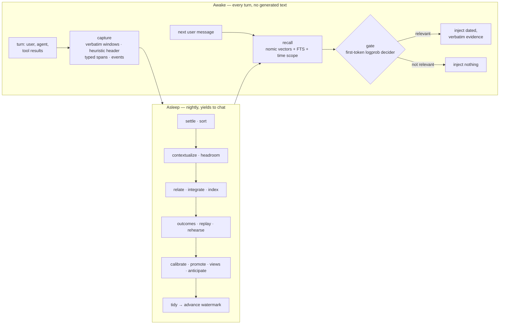

# Sophia

**Passive, associative memory for [Hermes Agent](https://github.com/NousResearch/hermes-agent) that organizes itself while you sleep.**

Sophia is a Hermes memory provider:

- **By day** it records everything verbatim and quietly hands the agent dated evidence from the past, or nothing at all.
- **At night** a local model reads the day back. It works out what was meant, pulls out facts, notices when plans changed, tests itself on what it learned, and builds a small wiki that grows its own structure.
- **It never initiates.** It doesn't speak, ask questions, or take actions. The agent's memory tools are the only deliberate part.

Everything runs locally against [LM Studio](https://lmstudio.ai): an embedding model, a small decider model, and a larger model that works only at night.

> Status: working prototype (v0.1). It has been exercised end to end inside real Hermes v0.21.4. See [what is built and what isn't](docs/DESIGN.md#15-implementation-status-prototype-2026-09-23).

---

## What it looks like

These are verbatim excerpts from real sessions on the test profile. Each one is a fresh `hermes chat`, and Hermes's built-in memory is switched off, so Sophia is the only link between them.

```text
session 1  Joey:   Hi, some context for later. I'm Joey. For the Yosemite trip in the second week
                   of May I'm bringing my Fujifilm X-T5, Sam is coming along, and we're staying at
                   Curry Village again. Also, my dentist Dr. Patel moved his office to 55 Oak
                   Avenue in Palo Alto. Just acknowledge briefly.

session 2  Joey:   Quick question: what camera am I bringing to Yosemite, who's coming, and where
                   is my dentist's office now?
           [gate: decider 0.97 → inject]
           Hermes: - Yosemite camera: Fujifilm X-T5  - Who's coming: Sam
                   - Dentist (Dr. Patel): 55 Oak Avenue, Palo Alto

session 3  Joey:   Change of plans for Yosemite: I'm bringing the Sony A7 IV instead of the
                   Fujifilm, the Fujifilm's sensor is acting up. Just acknowledge.

$ hermes -p sophiadev sophia sleep --model qwen35-9b                      # ~44 s
$ hermes -p sophiadev sophia journal
  #61 (undoable)  integrate  superseded  {"old": ["Joey", "is bringing", "Fujifilm X-T5"],
                                          "new": ["Joey", "is bringing", "Sony A7 IV to Yosemite"]}

session 4  Joey:   Which camera am I taking on the Yosemite trip?
           [gate: decider 0.95 → inject]
           Hermes: You're bringing the Sony A7 IV to your Yosemite trip 📷
                   Originally you had planned to bring your Fujifilm X-T5, but the camera's sensor
                   has been acting up, so you've switched to the Sony A7 IV instead.
```

The evidence the agent sees is always the original words, with dates. Facts help decide what gets found, and they label evidence that is out of date ("later changed"). They never replace what was actually said. That matters, because extraction is imperfect; notice the object "Sony A7 IV to Yosemite" above.

## How it works



### Awake

Sophia generates no text on the chat's critical path.

- **Capture.** Each turn is split into small verbatim windows. Each window gets a cheap heuristic header (speaker, date, the question it answers, names in play) and deterministic typed spans: times, durations, quantities, money, contacts, artifacts.
- **Web reads.** Pages the agent reads with `web_extract` or the browser are captured as sources. Failed fetches are dropped. Credential and vault tools are never captured.
- **Recall.** Before each reply, Sophia runs hybrid recall: nomic embeddings plus SQLite FTS, with time-scoped search for "last week" style questions. A strong enough match (cosine ≥ 0.82) is injected directly. Anything weaker goes to the decider.
- **The decider.** It is a small LLM that reads a single token's logprobs instead of writing an answer: one prefill, about 0.3 s. It decides whether memory has anything that bears on this message.
- **Measured on the test profile:** capture about 0.1 s; prefetch 260–460 ms including the gate.

### Asleep

`hermes sophia sleep` runs 15 steps in six phases:

| Phase | What happens |
|---|---|
| **Settle, sort** | Snapshot the day. Drop error pages, boilerplate, and pages that try to instruct the agent |
| **Understand** | A model writes context headers for every window: what "yes" agreed to, who "she" is. The headers are re-embedded; the evidence stays verbatim |
| **Consolidate** | Extract facts with modality (planned, habitual, negated…) and when they happen. Resolve entities. When a newer fact on the same relation names a different object, retire the older fact. This is automatic for relations learned to be exclusive; otherwise the decider judges it against the new evidence. "Not bringing X" retires "bringing X". Mark plans whose date passed as "unconfirmed" |
| **Dream** | Replay the day's injections and judge which ones helped. Rehearse new facts with self-made questions and repair any that recall can't find. Collect labels to calibrate the decider |
| **Organize** | Promote relations that keep recurring into canonical ones. Build entity pages and an upcoming-dates view |
| **Tidy** | Decay only what was repeatedly judged irrelevant, never facts flagged important (health, money, key dates). Journal everything, with undo. Advance the watermark last, so an interrupted night simply reruns |

The night run waits while the big model is serving chat, and yields rather than competing with you.

### Principles

- **The raw record is the truth; everything else is an index.**
- **Similarity ranks, the decider judges.** Cosine scores can't tell "related" from "answers it". The unanswerable near-misses we measured scored up to 0.78.
- **Emergent over prescribed.** Sophia designs in how to read values (time, money, modality) but not what the world contains. Entities, relations, and pages emerge. Structure is promoted when it recurs and demoted when it goes unused.
- **Credit orders what is shown; it never decides what may be shown.**
- **Degrade loudly.** If a model is missing, Sophia keeps working without it and `sophia status` says so.

The full reasoning is in [docs/DESIGN.md](docs/DESIGN.md).

## Requirements

- Hermes Agent (developed against v0.21.4).
- LM Studio serving three models:
  - `nomic-embed-text-v1.5` for embeddings (about 80 MB);
  - a small instruct model as the decider (Qwen3.5-9B Q4, reasoning off);
  - optionally a larger model for night work (Qwen3.8-27B). The 9B also works; every night run so far used it.
- `numpy`; it is already in the Hermes venv.

## Install

Tested path: link the package into a profile's plugin directory.

```bash
git clone https://github.com/jbpayton/hermes-sophia
ln -s "$PWD/hermes-sophia/hermes_sophia" ~/.hermes/profiles/<profile>/plugins/sophia

hermes -p <profile> config set memory.provider sophia
hermes -p <profile> config set memory.sophia.user_name <you>
hermes -p <profile> config set memory.sophia.agent_name Hermes
# use the identifiers `lms ps` shows:
hermes -p <profile> config set memory.sophia.embed_model nomic-embed
hermes -p <profile> config set memory.sophia.decider_model qwen35-9b
hermes -p <profile> config set memory.sophia.sleep_model qwen/qwen3.8-27b
```

To make Sophia the only memory, also set `memory.memory_enabled false` and `memory.user_profile_enabled false`. The package also declares a `hermes_agent.memory_providers` entry point, so `pip install` into the Hermes venv should work too; that path has not been tested in Hermes yet.

All settings are listed in [docs/CONFIGURATION.md](docs/CONFIGURATION.md). The data lives in `$HERMES_HOME/plugin-data/sophia/sophia.db` (SQLite, WAL).

## Use

The agent gets five tools:

| Tool | Use |
|---|---|
| `sophia_recall` | Deeper search. `history: true` also shows superseded facts and when they held |
| `sophia_query` | Counts, lists, date ranges; sums typed spans such as money |
| `sophia_browse` | The wiki: `entity`, `timeline`, `recent`, `sources`, `changes`, `topics` |
| `sophia_remember` | Keep a note, or mark a recalled item `helpful` / `wrong`. This is the strongest credit signal |
| `sophia_ingest` | Learn a document obtained outside the web tools |

And you get a CLI:

```bash
hermes -p <profile> sophia status                  # sizes, last night, degraded modes
hermes -p <profile> sophia recall "what camera…" --gate
hermes -p <profile> sophia sleep [--model M] [--steps a,b] [--max-wait S]
hermes -p <profile> sophia journal                 # what last night learned; #ids marked undoable
hermes -p <profile> sophia undo <id>
hermes -p <profile> sophia reconsolidate           # drop derived facts; the next night rebuilds them from raw
hermes -p <profile> sophia ingest-history --days 7 # import past sessions (idempotent)
```

### Nightly

Nothing is scheduled for you. When you're ready, add something like:

```cron
30 3 * * * hermes -p <profile> sophia sleep >> ~/.hermes/profiles/<profile>/logs/sophia-sleep.log 2>&1
```

## Development

```bash
pip install -e ".[test]"
pytest -q        # 22 tests against a fake LM Studio; no GPU needed
```

| Path | What |
|---|---|
| `hermes_sophia/` | The provider. Main modules: `capture`, `recall`, `decider`, `spans`, `store`, `tools`, `sleep/runner` |
| `tests/` | Awake and sleep tests with a deterministic fake LM Studio |
| `docs/DESIGN.md` | The design (v0.5) and implementation status |
| `docs/STORY.md` | How it got here: the research, the dead ends, and the bugs only real use found |
| `docs/archive/` | Earlier design versions |
| `research/` | The experiments behind the design: decider readouts, decision models, extraction bake-off, speed levers, embedding thresholds |
| `scripts/` | Debug helpers |

## Lineage

Sophia is a clean-sheet redesign rather than a port. It combines two earlier projects:

- [SophiaAMS](https://github.com/jbpayton/SophiaAMS): associative triple memory and the Mindscape graph browser.
- [Gemmery](https://github.com/jbpayton/gemmery): credit-earning memory, and the finding that retrieval over the raw record beats write-time summaries.

[docs/STORY.md](docs/STORY.md) tells how it got here.

## License

MIT
