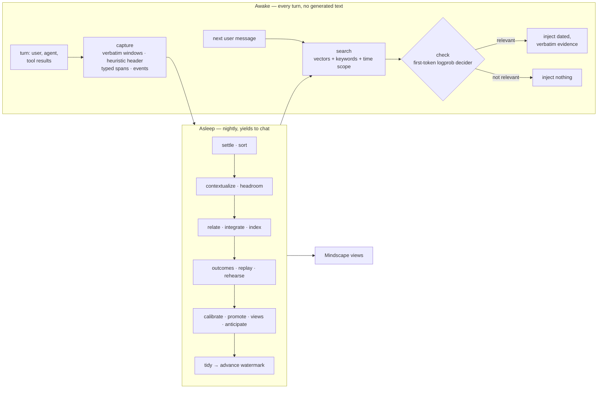

# Sophia

**Memory for [Hermes Agent](https://github.com/NousResearch/hermes-agent) that injects what's relevant before every reply, answers when the agent asks, and organizes itself while you sleep.**

Sophia is a Hermes memory provider. Memory reaches the agent in three ways:

1. **It's injected automatically.** Before every reply, Sophia checks whether anything it remembers bears on the message. If it does, it puts that into the agent's context as dated quotes of what was actually said. If nothing is relevant, it adds nothing. Nobody has to ask, and you never have to say "remember this".
2. **The agent can query it.** Memory tools let the agent dig deeper, count and list things, and ask what changed.
3. **The agent can browse it.** **Mindscape** is the wiki Sophia builds overnight: a page per person, place and thing, a timeline, sources, and a changelog. Every line links back to the words it came from.

Sophia also remembers **what the agent did**: every tool call by day, and at night a card per task with the steps that worked, the dead ends, the pages it learned from, and how it turned out. Ask for the same thing again and the card comes back.

Underneath is a **temporal memory graph** built overnight: people, places and things; what is true about them, and since when; and the exact words each fact came from. Recall walks it one hop, so a question about "Sam's sister" can reach where Lily lives.

Sophia never initiates anything. It doesn't speak, ask questions or take actions; the agent's tools are the only deliberate part. Everything runs locally against [LM Studio](https://lmstudio.ai), or an OpenAI-compatible server such as llama-server.

> Status: working prototype (v0.1), exercised end to end inside real Hermes v0.21.4. See [what is built and what isn't](docs/DESIGN.md#15-implementation-status-prototype-2026-09-23).

---

## 1. Automatic: memory injected before every reply

Each time you send a message, before the agent's model sees it, Sophia:

1. **Searches** everything it has recorded: conversations, pages the agent read, and facts extracted overnight. It combines vector search, keyword search, and date scoping for "last week" style questions.
2. **Follows the graph** one hop from the people and things in the best matches that the question itself doesn't name. The question "Where does Sam's sister live?" matches `Sam | has a sister named | Lily`, and the hop through Lily reaches `Lily | moved to | Denver`, which similarity alone ranked too low to inject.
3. **Checks** whether any of it actually bears on your message. A very strong match (cosine ≥ 0.82) passes straight through. Anything weaker goes to a small local model that answers yes or no by reading the probability of its first token, without generating any text. That check takes about 0.3 s.
4. **Injects** what passed into the agent's context, or nothing.

This is a real injection from the test profile, for "Which camera am I taking on the Yosemite trip?". It is an excerpt: 4 of the 8 items, in the order they were injected.

```text
Sophia memory — verbatim evidence from earlier conversations and reading (dates are when it was said;
treat assistant-authored lines as weaker evidence):
- [2026-09-23 · fact · planned · happens 2027-05-08/2027-05-15 · used +0.25] Sam | is coming on the trip to |
  Yosemite — "Hi, some context for later. I'm Joey. For the Yosemite trip in the second week of May I'm
  bringing my Fujifilm X-T5, Sam is coming along, and we're staying at Curry Village again."
  · evidence later changed: Joey is bringing Fujifilm X-T5 → Sony A7 IV to Yosemite (2026-09-23)
- [2026-09-23 · fact · planned] Joey | is not bringing | Fujifilm camera to Yosemite — "Change of plans for
  Yosemite: I'm bringing the Sony A7 IV instead of the Fujifilm, the Fujifilm's sensor is acting up. …"
- [2026-09-23 · fact · planned] Joey | is bringing | Sony A7 IV to Yosemite — "Change of plans for Yosemite: …"
- [2026-09-23 · Hermes (assistant said)] Got it — Yosemite trip in early May, bringing the Sony A7 IV instead of
  the Fujifilm X-T5 (sensor acting up), Sam coming along, staying at Curry Village again.
```

What the agent is told about each item:

| Label | Meaning |
|---|---|
| The quoted words | Always the original text. Extracted facts (`subject \| relation \| object`) help find it and label it; they never replace it |
| `planned`, `habitual`, `negated`, … | How the fact was said |
| `happens` | When it takes place, as distinct from when it was said |
| `evidence later changed` | These words include something that was later superseded, so the agent doesn't repeat a stale plan |
| `assistant said` | The agent's own earlier words: weaker evidence, and capped at two per injection |
| `linked via Lily` | Reached through the graph rather than by similarity |
| `untrusted source text` | Text from a web page, which the agent must treat as data, not instructions |
| `used +0.25` | Credit earned when this item actually helped a past answer. It affects ordering only, never whether an item may be shown |

For an off-topic message ("What's the capital of Australia?") the check said no (0.45), so nothing was injected.

**What is never injected:**
- the agent repeating memory back (echoes);
- agent replies that stated facts about you that nothing in the turn supported. These are checked as they're captured, because an invented answer recalled later becomes "memory";
- your own earlier questions, which carry no facts;
- failed page fetches.

## 2. On request: memory the agent can query

| Tool | Answers |
|---|---|
| `sophia_recall` | "Dig deeper": a wider search. `history: true` also returns superseded facts and when they held |
| `sophia_query` | "How many… / list every… / what happened between…". Filters facts and sums typed values such as money |
| `sophia_browse` | "What do you know about…": reads Mindscape (next section) |
| `sophia_remember` | "Keep this", or marks a recalled item `helpful` or `wrong`. This is the strongest learning signal memory gets |
| `sophia_ingest` | "Learn this document" |

Pages the agent reads with `web_extract` or the browser are learned automatically, so `sophia_ingest` is only for documents obtained some other way. A real `sophia_query` call, `{"subject": "Joey"}`, trimmed:

```json
{"count": 4, "items": [
  {"fact": ["Joey", "is bringing", "Sony A7 IV to Yosemite"], "modality": "planned", "status": "active", "believed_from": "2026-09-23 14:38"},
  {"fact": ["Joey", "is staying at", "Curry Village"], "modality": "planned", "happens": "2027-05-08/2027-05-15", "status": "active"},
  …]}
```

## 3. Mindscape: memory you can look around in

Recall answers a question. **Mindscape is for when you don't know the question yet.**

Every night Sophia reorganizes what it knows into views:

| View | What it shows |
|---|---|
| `entity` | Everything currently believed about a person, place or thing, the history of what changed, and every mention with its date and speaker. A full page appears once enough is known |
| `timeline` | What was said, or what happens, in a date range such as "last week" or "March" |
| `recent` | Today's memory, before the night has consolidated it |
| `sources` | The pages and documents it learned from |
| `changes` | What last night learned, superseded or merged. Supersessions can be undone |
| `topics` | The relations and entities that emerged, and which of them have been promoted to canonical structure |

Nobody designs these pages; they emerge from what you talk about. Relations that recur across sessions get promoted into canonical structure. The only things designed in are how to read values: dates, money, quantities, and whether something was planned or negated. Demoting structure that goes unused is part of the design but isn't built yet.

Mindscape gives you:
- **Orientation:** "what do you know about Dr. Patel?" returns a page, not a pile of search hits.
- **Provenance:** every belief traces back to who said it and when.
- **Accountability:** you can see what changed overnight, and undo a supersession.

Real output of `sophia_browse {"view": "entity", "key": "Dr. Patel"}`, trimmed:

```json
{"entity": "Dr. Patel",
 "current": [["Dr. Patel", "moved his office to", "55 Oak Avenue in Palo Alto", "asserted"]],
 "history": [],
 "mentions": [{"date": "2026-09-23 14:36", "speaker": "Joey",
               "text": "Also, my dentist Dr. Patel moved his office to 55 Oak Avenue in Palo Alto. …"}, …]}
```

Today the agent reaches Mindscape through `sophia_browse`. In SophiaAMS, Mindscape was a visual graph browser; a visual browser over these views is on the roadmap.

## 4. Task memory: what the agent did, and how it turned out

Hermes's own skills are the *rulebook*: general "how we do X" rules, which Hermes writes itself as it works. Sophia keeps the *logbook*: what actually happened each time.

- **By day, with no model calls.** Every tool call is recorded in order, with:
  - its arguments (secrets redacted) and the start and end of its result;
  - its exit code or error;
  - the request it served.

  Credential and vault tools are never recorded.
- **At night.** The action log is split into tasks. A follow-up like "try python3.12 instead" joins the task it continues. The outcome is judged from the results and your reaction: succeeded, failed, partly, abandoned or unclear. Then a card is written. The night model only points at logged actions by number, and code assembles the card from the log, so **a card can't contain a step the agent didn't take**.
- **In recall.** When a request resembles a past task, its card is injected. A failed or abandoned attempt comes with a warning. `sophia_browse {"view": "tasks"}` lists past tasks, and passing a task id returns its full action log.
- **Credit.** When a card is followed again, it gains credit if the task succeeds and loses credit if it fails.

This card came from a real run on the test profile. The agent was asked to create `/tmp/sophia-task-demo`, write a file and report its checksum:

```text
- [2026-09-24 · earlier task · succeeded] Create directory, write text file, and compute sha256sum
  (/tmp/sophia-task-demo) — succeeded on 2026-09-24. Worked: `mkdir -p /tmp/sophia-task-demo` →
  `write_file(path="/tmp/sophia-task-demo/notes.txt", content="hello from sophia")` →
  `sha256sum /tmp/sophia-task-demo/notes.txt`.
```

In a fresh session, "Do the sophia-task-demo notes file thing again, the same way as last time" injected only this card (0.88), and the agent redid the task.

On five scripted sessions with known outcomes (`bench/tasks_eval.py`, 9B night), the results were:
- **Outcomes:** 5/5.
- **Task splits:** 5/5.
- **Card details:** 5/5 (dead ends with reasons, doc links, the corrected step).
- **Recall:** 4/4. The right card came back for every "do it again" request.

For example:

```text
Rotate nginx logs on web-1 to free disk space (web-1) — succeeded. Worked: `ssh web-1 'sudo logrotate -f
/etc/logrotate.d/nginx'`. Dead ends: `ssh web-1 'rm /var/log/nginx/access.log'` (permission denied without
sudo). Lesson: Use sudo with logrotate instead of manually deleting log files
```

---

## What it looks like across sessions

These are verbatim excerpts from real sessions on the test profile. Each one is a fresh `hermes chat`, and Hermes's built-in memory is switched off, so Sophia is the only link between them.

```text
session 1  Joey:   Hi, some context for later. I'm Joey. For the Yosemite trip in the second week
                   of May I'm bringing my Fujifilm X-T5, Sam is coming along, and we're staying at
                   Curry Village again. Also, my dentist Dr. Patel moved his office to 55 Oak
                   Avenue in Palo Alto. Just acknowledge briefly.

session 2  Joey:   Quick question: what camera am I bringing to Yosemite, who's coming, and where
                   is my dentist's office now?
           [gate: decider 0.97 → inject]
           Hermes: - Yosemite camera: Fujifilm X-T5  - Who's coming: Sam
                   - Dentist (Dr. Patel): 55 Oak Avenue, Palo Alto

session 3  Joey:   Change of plans for Yosemite: I'm bringing the Sony A7 IV instead of the
                   Fujifilm, the Fujifilm's sensor is acting up. Just acknowledge.

$ hermes -p sophiadev sophia sleep --model qwen35-9b                      # ~44 s
$ hermes -p sophiadev sophia journal
  #61 (undoable)  integrate  superseded  {"old": ["Joey", "is bringing", "Fujifilm X-T5"],
                                          "new": ["Joey", "is bringing", "Sony A7 IV to Yosemite"]}

session 4  Joey:   Which camera am I taking on the Yosemite trip?
           [gate: decider 0.95 → inject]
           Hermes: You're bringing the Sony A7 IV to your Yosemite trip 📷
                   Originally you had planned to bring your Fujifilm X-T5, but the camera's sensor
                   has been acting up, so you've switched to the Sony A7 IV instead.
```

Extraction is imperfect; notice the object "Sony A7 IV to Yosemite". That is exactly why the agent always sees the original words and not just the extracted facts.

## How it works



### Awake: capture

Nothing generates text on the chat's critical path.

- **Turns.** Each turn is split into small verbatim windows. Each window gets a cheap header (speaker, date, the question it answers, names in play) and deterministic typed values: times, durations, quantities, money, contacts, artifacts.
- **Actions.** Every tool call is recorded with its arguments, the start and end of its result, its exit code, and the request it served. This is the raw material for task memory.
- **Web reads.** Pages the agent reads are captured as sources. Failed fetches are dropped, and credential or vault tools are never captured.
- **Speed.** Capture takes about 0.1 s per turn, off the critical path. The search-check-inject step takes 260–460 ms on the test profile.

### Asleep: the nightly run

`hermes sophia sleep` runs 15 steps in six phases:

| Phase | What happens |
|---|---|
| **Settle, sort** | Snapshot the day. Drop error pages, boilerplate, and pages that try to instruct the agent |
| **Understand** | A model writes context headers for every window, such as what "yes" agreed to or who "she" is. The headers are re-embedded; the evidence stays verbatim |
| **Consolidate** | Split the action log into tasks, judge each outcome, and write task cards. Extract facts with modality and when they happen, and resolve entities. When a newer fact on the same relation names a different object, retire the older one: automatically for relations learned to be exclusive, otherwise judged against the new evidence. Plans whose date passed become "unconfirmed" |
| **Dream** | Replay the day's injections and judge which ones helped. Rehearse new facts with self-made questions, and repair whatever recall misses. Collect labels to calibrate the check |
| **Organize** | Promote recurring relations and build the Mindscape views |
| **Tidy** | Decay only what was repeatedly judged irrelevant, never facts flagged important (health, money, key dates). Journal everything with undo. Advance the watermark last, so an interrupted night simply reruns |

The night waits while the big model is serving chat, and yields rather than competing with you.

### How it compares

The data model (three clocks, supersession, provenance, triples indexing passages) has converged with the best graph memories: Graphiti/Zep, SodaMem, HippoRAG 2 and Hindsight. What's different is how Sophia behaves:
- it makes no model calls when something is saved;
- it checks relevance and can inject nothing;
- its own invented claims can't become memory;
- a night tests and repairs its own recall.

**Benchmarks** (held-out data, a local 9B as reader and judge; [docs/BENCHMARKS.md](docs/BENCHMARKS.md)):
- **LongMemEval-S, 60 questions:** 0.750. The same reader scores 0.917 when handed the evidence sessions.
- **LoCoMo, 7 conversations:** J 0.730 after one night, against 0.768 with the whole conversation in context.

These aren't directly comparable with published GPT-4o-judged numbers. The comparison and sources are in [docs/COMPARISON.md](docs/COMPARISON.md).

### Principles

- **The raw record is the truth; everything else is an index.**
- **Similarity ranks; the decider judges.** Cosine scores can't tell "related" from "answers it": unanswerable near-misses scored up to 0.78.
- **Emergent over prescribed.** Design how to read values, not what the world contains.
- **Credit orders what is shown; it never decides what may be shown.**
- **Degrade loudly.** If a model is missing, Sophia carries on without it, and `sophia status` says so.

The full reasoning is in [docs/DESIGN.md](docs/DESIGN.md).

---

## Requirements

- Hermes Agent (developed against v0.21.4).
- A model server, LM Studio by default, serving three jobs:

| Job | Recommended | Notes |
|---|---|---|
| Embeddings | `nomic-embed-text-v1.5` | about 80 MB |
| Decider (the per-turn check) | Qwen3.5-9B Q4, reasoning off | Only reads token probabilities. Too small a model fails badly: a 0.8B waved "capital of Australia" through at 0.90 |
| Night work | Qwen3.8-27B, or the 9B | Every night run so far used the 9B |

- `numpy`, which is already in the Hermes venv.

## Install

Tested path: link the package into a profile's plugin directory, then run Hermes's setup.

```bash
git clone https://github.com/jbpayton/hermes-sophia
ln -s "$PWD/hermes-sophia/hermes_sophia" ~/.hermes/profiles/<profile>/plugins/sophia
hermes -p <profile> memory setup        # pick "sophia"
```

Setup always asks for the basics: your name, the agent's name, the server, and a model for each job. Then it asks two more questions:
- whether all jobs share one server or each gets its own;
- whether to customize recall, capture and night tuning.

You can also set any value directly:

```bash
hermes -p <profile> config set memory.sophia.decider_model qwen35-9b
```

To make Sophia the only memory, set `memory.memory_enabled false` and `memory.user_profile_enabled false`. The package also declares a `hermes_agent.memory_providers` entry point for `pip install`; that path hasn't been tested in Hermes yet.

## Configure: models and servers

Each job has its own model, and optionally its own server:

```yaml
memory:
  provider: sophia
  sophia:
    lmstudio_url: http://127.0.0.1:1234     # the default server for every job
    embed_model: nomic-embed
    decider_model: qwen35-9b
    decider_url: http://127.0.0.1:8081      # this job only: a llama-server on its own GPU
    decider_api: openai                     # lmstudio | openai (llama-server, vLLM, …)
    sleep_model: qwen/qwen3.8-27b           # sleep_url / embed_url default to lmstudio_url
```

`hermes sophia status` shows where each job actually runs. Every setting is described in [docs/CONFIGURATION.md](docs/CONFIGURATION.md). The data lives in `$HERMES_HOME/plugin-data/sophia/sophia.db` (SQLite, WAL).

## CLI

```bash
hermes -p <profile> sophia status                  # sizes, where each job runs, last night, degraded modes
hermes -p <profile> sophia recall "what camera…" --gate
hermes -p <profile> sophia sleep [--model M] [--url U --api openai] [--steps a,b] [--max-wait S]
hermes -p <profile> sophia journal                 # what last night learned; #ids marked undoable
hermes -p <profile> sophia undo <id>
hermes -p <profile> sophia reconsolidate           # drop derived facts; the next night rebuilds them from raw
hermes -p <profile> sophia ingest-history --days 7 # import past sessions (idempotent)
```

Nothing is scheduled for you. When you're ready, add a nightly run:

```cron
30 3 * * * hermes -p <profile> sophia sleep >> ~/.hermes/profiles/<profile>/logs/sophia-sleep.log 2>&1
```

## Development

```bash
pip install -e ".[test]"
pytest -q        # 47 tests against a fake model server; no GPU needed
```

| Path | What |
|---|---|
| `hermes_sophia/` | The provider. Main modules: `capture`, `recall`, `decider`, `spans`, `store`, `tools`, `sleep/runner` |
| `tests/` | Awake, sleep and configuration tests with a deterministic fake server |
| `docs/DESIGN.md` | The design (v0.5) and implementation status |
| `docs/STORY.md` | How it got here: the research, the dead ends, and the bugs only real use found |
| `docs/CONFIGURATION.md` | Every setting |
| `docs/COMPARISON.md` | How Sophia compares with other graph and agent memories |
| `docs/BENCHMARKS.md` | LongMemEval and LoCoMo: protocol, results, what changed |
| `bench/` | The benchmark harness |
| `research/` | The experiments behind the design |
| `scripts/` | Debug helpers |

## Lineage

Sophia is a clean-sheet redesign, not a port. It combines two earlier projects:

- [SophiaAMS](https://github.com/jbpayton/SophiaAMS): associative triple memory, and the original Mindscape graph browser.
- [Gemmery](https://github.com/jbpayton/gemmery): credit-earning memory, and the finding that retrieval over the raw record beats write-time summaries.

[docs/STORY.md](docs/STORY.md) tells how it got here.

## License

MIT
