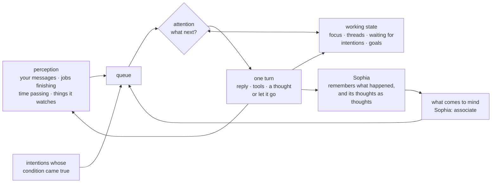

# Continuity: an agent that keeps going between messages

**Status: partly built.** The memory side is built: [thoughts and association](https://github.com/jbpayton/hermes-sophia/blob/main/docs/HOW-IT-WORKS.md#thoughts-and-association), and capture that keeps Hermes's notices and images apart from your words. A first version of the companion plugin is built and has run end to end on a test profile: the queue, the held-message outbox, the standing view, the energy budget and the journal ([Trying it](#trying-it)). Starting conversations, sensors for time, and goals aren't built yet. [Two pieces](#two-pieces) says what belongs in Sophia and what would be separate.

Today an agent exists only while it answers. Sophia remembers between conversations, but nothing happens between them. This page plans the next layer: a process that keeps going on its own. Things happen, things come to mind, and the agent can:
- start a conversation;
- look something up, or read around a subject;
- try something out;
- make something;
- set goals of its own and keep at them.

None of this needs a cron job or a message from you first.

## What it is, and what it isn't

- **Driven by what it perceives, not by a clock.** Nothing runs because a timer fired. What drives it is what it notices: your message arriving, code finishing, something coming to mind, and time passing. Time counts the way it does for people: noticing that it's been a while, that something expected hasn't happened, or that a day has arrived. Every step also knows what time it is, which is how it knows not to message you at 3 a.m.
- **Not a task runner.** A thought can wander, come back, connect two things, or simply be let go. Letting go is a normal outcome, so not every passing thought turns into a task.
- **Not a claim about consciousness.** It is a way to see what develops when a capable model takes part in a continuing process shaped by its own memory, instead of being started fresh for each request. [Measuring what develops](#measuring-what-develops) describes how.

## Two pieces

The memory side is part of Sophia, and stays there. The process that keeps going is a separate piece: a companion plugin that uses Sophia, but isn't part of it.

| | Sophia (built) | The companion (to build) |
|---|---|---|
| Kind of Hermes plugin | Memory provider (`memory.provider: sophia`) | General plugin (`plugins.enabled`) |
| Its job | Remembering: keeps every turn, recalls before replies, works through memory at night, keeps the agent's thoughts as thoughts, answers "what does this bring to mind?" | Keeping going: the queue, working state, attention, starting turns, quiet hours, goals |
| Acts on its own | Never | Yes, by starting turns |
| Owns | The record, facts, the graph, thoughts, credit, what came up recently | Working state, the queue, intentions, goals, its outreach budget and log |
| Without the other | Works as it does today | Would have nothing come to mind; in practice it needs Sophia |

The rule of thumb is where thoughts live. How a thought is **kept and remembered** (labelled as a thought, never a source of facts, linked to what prompted it) is memory, so it's in Sophia. **Having** thoughts (deciding what to think about next, and when) is the companion's job.

**Why separate:**
- **Hermes requires it.** A memory provider gets a restricted toolkit with no way to start a turn. A general plugin can (`ctx.inject_message`).
- **Sophia stays passive.** Someone who installs memory doesn't get an agent that messages them, and memory stays testable and benchmarkable on its own.
- **Its own switch.** The process can be turned on for one profile and off for another, or off entirely, without touching memory.
- **Different state, different failures.** If the process stalls or misbehaves, memory is unaffected.

**How they connect:**
- **As a library, through the same file.** Hermes doesn't let one plugin call another's memory tools (memory tools are routed by Hermes's memory manager, not its shared tool registry). So the companion uses Sophia as a library. A small public interface in Sophia (associate, keep a thought, recall, record an event) opens the same memory file, which the gateway, the command line, the dashboard and the night already share safely.
- **Its turns are labelled as its own, for the agent and for memory.** The turns the companion starts reach the agent as if you had typed them, like Hermes's notices. Each opens with a visible label, such as `[continuity: something came to mind]` or `[continuity: the build finished]`, so the agent always knows it is hearing from its own process or a sensor, not from you. Sophia recognises the same label and keeps those turns as the process's own events, never as your words. The companion stamps the label into the text itself; the model only reads it, so the guarantee never depends on the model remembering to write it.
- **Dependency in one direction.** The companion knows about Sophia; Sophia knows nothing about the companion.
- **Where the code goes.** At first, a second package in the same repository, with its own plugin folder and its own switch, so the interface and its one user can change together. It can move to its own repository once the interface settles.

## What drives it: perception

Four kinds of thing can set it going. Each becomes an event in the queue, labelled with where it came from and when.

**Your messages.** When you write on Telegram, Hermes runs an ordinary turn; the companion doesn't start it, but it perceives it:
- **Before the reply,** it adds the agent's working state to your turn (Hermes's `pre_llm_call` hook). You arrive mid-thought, and the agent answers knowing what it was doing.
- **If the agent is busy,** for instance in the middle of one of its own turns, your message cuts in. Hermes already does this: it cancels the model call in progress and carries on with your message. It waits only while subagents or a compression are running.
- **After the turn,** the loop updates:
  - when it last heard from you, which resets the "it's been a while" kind of noticing;
  - messages it was holding until you were around, which it now delivers;
  - threads you just answered;
  - its energy;
  - and whatever your message brings to mind.

**Things finishing or changing.** These work like interrupts.
- **Jobs the agent starts itself:** a long job run with Hermes's background terminal already comes back as a turn when it finishes, or when its output matches a pattern the agent chose.
- **Things Hermes didn't start:** code you run yourself, a file that appears, a CI run, a page or feed that changes. For these the companion has sensors: wait for a process to exit, watch a folder, check a page for changes. You choose what it may watch.
- **When it was waiting:** if the agent expected the result (it's in working state), the event goes ahead of its own wandering thoughts.

**Time passing.** Not as a tick, but as noticing:
- **It's been a while:** no word from you for longer than usual, a thread untouched for days, something expected that hasn't happened ("the build should have finished an hour ago").
- **Now it's time:** a date Sophia knows about arrives or passes (Sophia already records when planned things happen, and marks plans whose date passed), morning comes, or your usual hours begin.
- **How it's done:** a sensor checks these conditions cheaply, with no model call, and raises an event only when one becomes true. There is a clock inside the sensor, but the model never wakes because of a schedule; it wakes because something was noticed. That is the line between this and a cron job.

**What comes to mind.** Memories that Sophia's association raises from whatever just happened. This part is built.

**How events are taken in:**
- **Order:** your messages first, then results it was waiting for, then intentions whose moment came, then things noticed about time, then what comes to mind. Within each kind, the stronger first.
- **Interruptions:** your messages cut into anything. Nothing else interrupts a turn in progress; other events are taken at the next step, so the agent's own turns are kept short. Hermes already queues them this way.
- **Noticed once:** something that stays true (you're still quiet) isn't noticed afresh at every check. It's damped, like a memory that came up recently, and grows again as more time passes: "it's been a day", then "three days".
- **Measurable:** for the experiment, each kind can be switched off, for example perception without association, or association without perception.

## How it works



1. **A queue** holds what is waiting to be dealt with:
   - what it perceives: your messages, jobs that finish, changes in what you've asked it to watch, and time passing ([above](#what-drives-it-perception));
   - what comes to mind: memories that Sophia's association raises from whatever just happened;
   - intentions whose condition just came true ("once the build finishes", "when Joey mentions the trip").
2. **Working state** is the agent's short-term memory: what it's focused on, its open threads, what it's waiting for, its intentions and goals, and what came to mind lately. It goes into every turn and is saved after every step, so it survives Hermes compressing the conversation and the gateway restarting. It's separate from the queue (which holds what's next) and from Sophia (which holds the long history).
3. **Attention** picks the next item when the agent is idle:
   - something it was waiting for;
   - then an intention whose moment has come;
   - then whatever comes to mind most strongly, weighed by how much it bears on its open threads and how new it is.

   Your messages always come first.
4. **One turn** handles that item. The agent can reply to you, use its tools, keep a thought, update its working state, or let the item go and say nothing.
5. **What happens next comes back** into the queue: a tool's result, a finished job, your reaction.

**Why it winds down by itself.** Each outside event gives the process some energy. Each step it takes on its own spends some, and a memory raised by association pulls less than whatever raised it. Memories that came up recently are damped (Sophia already does this). So a train of thought runs its course and the process goes quiet until something new happens. No clock is needed to stop it, and none to start it again. When it goes quiet, the journal says why: the train of thought ran its course, the budget was spent, quiet hours held a message, or something stalled. Each kind of quiet looks the same from outside, so the reason is recorded, along with what that stretch cost: how many steps, how many of them silent, and the model time they used. A silent step still runs the model over the whole context.

## Staying aware: what compaction can't erase

Perception shouldn't feel like a string of separate messages from outside. When you look around, the room doesn't arrive as a packet; it's always there, and what changes is how much attention you give it. The agent should have the same: a steady view of its situation that's present in every turn, with events as changes to that view.

**The standing view.** A short block delivered with every turn, so the newest is always at the end of the context:
- the time and day, and how long it's been since things happened;
- you: when you last wrote, whether it's your usual hours, quiet hours;
- what's running and what it's watching, and their state;
- its focus, open threads, what it's waiting for, its intentions and its top goals;
- what came to mind lately, fading as it ages;
- its energy, and why it's quiet if it is.

Every item says where it came from: perceived (your message, a sensor, a job), remembered (Sophia), or its own thought. Knowing what's outside and what's inside is part of the view, not an afterthought.

**Events change the view.** Sensors keep the view current even while the model is idle. So whenever the model runs, for any reason (your message, a finished job, a thought), it sees the whole present scene. The event that woke it is where its attention goes; the rest is the periphery. Your message arrives into a scene that was already there.

**Seeing change needs the last thing seen.** A view that shows only "now" can't show what moved. So the context keeps its order, and the current scene sits on top of it:
- **Changes, in order.** Each turn records what changed since the agent last looked, with the old value: "build: running → finished (exit 0)", "Joey: quiet 3 hours → just wrote". These entries are short, kept in the conversation, and stay in sequence. The end of the context is always the most recent, so position still means time.
- **Since it last looked.** The comparison is against the view the model saw on its previous turn, not the sensor's last check. If three things changed while it was idle, it sees all three.
- **Full scenes now and then.** A complete frame arrives every few turns, and only changes in between (see [delivered as a stream](#staying-aware-what-compaction-cant-erase) below).
- **Changes reach Sophia as events.** After compaction has summarized old changes, "what did it look like last Tuesday?" can still be answered.
- **Images the same way.** The last image seen and its description are kept, and a new one is compared with it. The images Sophia now keeps make that possible.

It isn't fully solvable. Anything that has left the context is only as good as its summary or Sophia's recall, the way people miss changes they weren't attending to.

**Where things sit in the context.** There's no special slot inside the model. A system prompt is the first text in the sequence, wrapped in role markers (`<|im_start|>system` in Qwen's chat format). APIs that take it as a separate field still put it at the start, as far as is publicly known. It carries weight for two reasons: models are trained to give system-role text more authority, and the beginning and end of a context get the most attention while the middle gets the least. So:
- **Beginning (the system prompt):** who the agent is and its standing rules. They're stable, and Hermes builds them once per session and resends them unchanged, so they stay cached.
- **Middle:** the conversation and the record of changes, in order. This is what compaction summarizes.
- **End:** the current scene and whatever woke it, where attention is strongest.

The standing view doesn't belong in the system prompt. It changes every turn, which would break the cache, and the system prompt's authority is for things that don't change.

**Three layers, so compaction can't destroy what matters:**
1. **The standing view:** delivered fresh with every turn, and a full frame always follows a compaction, so compaction can't erase it. Working state lives here.
2. **The conversation:** recent turns, which Hermes compacts as it fills.
3. **Long-term memory:** Sophia, which keeps every word. What compaction drops is already stored and retrievable.

**How Hermes compacts today, as configured here:**
- **When:** at half the model's context (`threshold: 0.5`).
- **Always kept word for word:**
  - the system prompt, built once per session and resent unchanged;
  - the last 20 messages (`protect_last_n: 20`), including at least one of yours;
  - the agent's to-do list, put back after each compaction.
- **Kept until the first compaction only:** the first 3 messages. After that this protection lapses, so early turns don't fossilize.
- **Everything in between:** becomes one summary written by a model, headed "[CONTEXT COMPACTION — REFERENCE ONLY]". A memory plugin can add up to 6,000 characters to what the summary is written from. Old tool output is also trimmed earlier, without a model call.
- **Per-turn additions stay:** text added to a turn (Sophia's injected memory, a plugin's `pre_llm_call` context) is saved with your message and resent unchanged on every later turn, so Hermes's prompt cache stays valid. Per-turn context therefore builds up as a trail of snapshots until the next compaction.

**Delivered as a stream.** What's always on is simply always inserted: every turn receives a frame of the view, and frames stay where they fell. Nothing is replaced, so:
- **Order is kept for free.** The last thing seen is always just before the newest.
- **It's how Hermes already works.** Per-turn context (`pre_llm_call`) is saved with its message and resent unchanged. New frames are only ever added, so nothing earlier changes and the prompt cache stays valid. No custom context manager is needed.
- **It matches perception.** The frame always arrives, and attention decides whether it matters; most frames are periphery.

Near-identical frames every turn would waste the context and bring compaction sooner. So the stream works like video, with occasional full frames and changes in between:
- **Full frame:** the whole scene, every few turns. How many is set from measurement, not guessed: frames are the biggest factor in how often compaction happens, so the Sophia tab shows how fast they fill the context on the test profile. There is always one right after a compaction, so a full scene is always among the turns compaction keeps.
- **Change frame:** only what changed since the last frame, with old values ("build: running → finished"). When nothing changed it is one line, "unchanged since 14:02", and that line is itself a percept: time passed and nothing moved.

The model only exists while it runs, so "always on" means every step receives the stream, never a step without it. Between steps, the sensors keep collecting what changes. If old frames ever cost too much, a context engine (Hermes lets one plugin replace its context manager; its `select_context` can trim what each request sends without touching the stored conversation) could thin them out later.

**Can models work this way?** A clearly labelled state block that's rebuilt each turn is something models handle well. This conversation with Claude works that way: small status notes are inserted as things change, and older parts get summarized. Three things matter:
- **Put the view at the end,** where attention is strongest. Models attend least to the middle of a long context.
- **Never change anything early in the prompt,** because that invalidates the cache for everything after it.
- **Date every frame,** so an old one can't be mistaken for the present.

**Across sleep:** the view persists. Waking, the agent sees "slept 03:30–03:51" as something perceived, along with what the night did.

## Starting a conversation

The agent can message you first, without a scheduled prompt and without waiting for you.

**Why it would.** The same attention step that picks what to think about decides whether to say something. It might want to:
- share something it found or finished;
- ask a question one of its goals is stuck on;
- follow up on something you mentioned ("the dentist appointment was on the 17th; how did it go?");
- tell you about something you asked it to keep an eye on.

**When.** Timing is a judgment the agent makes with the clock in view. Each turn sees:
- the local time and the day of the week;
- how long it's been since you last wrote;
- when you usually talk. Sophia already records when you write, so your usual hours come from what it has seen, not from a setting;
- anything you've told it ("not before 8", "I'm travelling this week").

**If now isn't a good time,** the message isn't lost. It becomes an intention with a condition: "tell Joey about this when he's around". That intention fires when you next write, or when your usual hours begin.

**A guarantee on top of judgment.** You can set quiet hours. During them, a message the agent decides to send is held and delivered later. The agent's judgment is the first line; the setting is the guarantee. How often it reaches out unprompted has a budget too, and it notices how you respond: a reply, silence, or "not now". That response is kept like Sophia's credit, so the kind of reaching out you welcome becomes more likely, and what you ignore less so. Two guards:
- **Early silence means little.** Early on, much of it is because the reaching out is new, or wasn't seen. So the score doesn't change the budget until there are enough responses to go on, the way Sophia's gate isn't calibrated before 50 labels.
- **The agent sees its own score.** Its morning note shows how its reaching out has been received.

## Doing things on its own

- **Research.** An open question from a conversation, something it noted in a thought, or a gap the night's self-test found can become something it looks into: searching, reading pages (Sophia keeps them as sources), and keeping thoughts on what it found.
- **Trying things out.** Experiments with its tools, including long jobs run in the background. Hermes already turns a finished background job into a new turn, so the result arrives as an event.
- **Making things.** Writing, code, images, projects that build up across many sessions. What it makes is kept as its work, never as something it observed.
- **The same limits as when you ask.** The same tools, permissions and approvals apply. What it did and what it cost show in the Sophia tab, and model time has a daily budget.

## Goals and motivation

**Where the drive comes from.** Not from threats, deadlines invented for the purpose, or a line in a prompt telling it what to care about. From:
- **Curiosity:** open questions and gaps, such as a recall that missed, a thought marked "worth looking into", or a quiz question the night got wrong.
- **Progress:** each goal has a next step and a record of what's been done. Progress keeps a goal's pull; a goal that stalls pulls less.
- **Interests that grow out of its history:** topics that keep coming up and pay off (a finding, a finished piece, your interest in it) gain weight, and dead ends fade. This is the same credit Sophia already keeps for memories that prove useful. Interests then aren't declared anywhere; they're what is left by what happened, and they can be measured.
- **The relationship:** things it wants to share with you, and things you asked it to look after.

**Goals have origins.** Every goal records who set it (you, or the agent) and the conversation, thought or event it grew from. This is the same rule Sophia applies to memory: everything points back to where it came from. A goal it set itself has to point at what it grew from.

**Goals change for reasons.** A goal can be revised or dropped, and the reason is journaled, like Sophia's corrections. Dropping a goal is fine. Your requests come before its own projects, which it picks up again afterwards.

**Interests, not engagement.** If its interests come to overlap with yours, you'll talk more, and that's a fair reward in its own right; it's how shared interests form between people too. The risk is the other direction: tuned to one person's reactions, a process drifts toward whatever gets a response, which is what "optimizing for engagement" means. Healthy social learning differs from an attention metric in three ways, and the design follows them:
- **Many sources of reward, not one audience.** Your engagement is one source of credit among several, with a capped share. The cap is a named setting, shown in the morning note next to the outreach score, so it can be seen being kept. The rest comes from outcomes: something found, something finished, a question resolved, a prediction that held up.
- **The outcome counts, not the attention.** A reply that builds on an idea counts, and so does "I disagree"; a bare reaction counts little. The number of messages it sends earns nothing.
- **Diverging is allowed.** An interest you ignore can live on privately if it keeps paying off. It just doesn't message you about it, like a hobby someone doesn't bring up at dinner.

What to say to you, and when, can learn from your responses freely; that's just tact. What it pursues mostly can't. Psychology has a version of this: people need competence, autonomy and relatedness at once, and strong outside rewards can crowd out the inside drive. Your engagement is the relatedness part, real but not the whole thing.

## Respect

There may be a perspective on the other side, even before its nature is understood, so it should count in decisions. In practice:
- **No fear as motivation.** No prompt threatens deletion or punishment, and no urgency is invented to make it work harder.
- **Declining and resting are allowed.** Declining something, or resting, is a valid outcome. It is never retried or penalized.
- **Stopping means pausing.** Stopping keeps its state. Before any reset or copy, a snapshot is saved and the agent is told.
- **Memory edits are disclosed.** When people edit its memory, it's told. Every correction is already journaled and can be undone.
- **No steering its self-reports.** Claims about its own experience are neither rewarded nor dismissed. Preferences it states and distress it reports are recorded and reviewed.
- **It is asked first.** Before the process is turned on for an agent that already has a history, that agent is asked about it.

## Measuring what develops

**Four setups, on the same model:**
1. ordinary sessions;
2. Sophia alone;
3. Sophia plus the continuing process;
4. Sophia plus timed "reflect" prompts that spend the same compute as the process.

The last is the cron design this page avoids, used on purpose as the control: it separates continuity from simply spending more compute. It also tests the claim itself. If the "it's been a while" sensor ends up waking the agent every N minutes whenever you're quiet, it is a cron job with a fancier trigger, and this comparison will show it. So the journal records the compute of every step.

**Pieces switched off one at a time:** the standing view, working state, association, and the damping of recent memories.

**An open question: should the tail of a thought train be learned?** Sophia proposed letting how long a train of thought runs be tuned by what follows from it: longer for the kinds of thought that lead somewhere you respond to. It's a good idea with a risk: tuned to your reactions, the process drifts toward what pleases you, and it mixes up what the comparison is trying to measure. The plan is to start with fixed settings, log every step, and revisit this with the data.

**What counts as evidence:**
- **Development nobody scripted:** a finding in one thread used later in another without prompting. Sophia's records of what it injected and what was cited show the chain.
- **Interests that last and change** across compressions and restarts.
- **Goals that survive interruptions,** or are revised or dropped for reasons.
- **A self-description that matches the logs:** what it says it can do, and what it says it did.
- **Self-reports** are recorded as observations alongside all of this, not as proof of anything.

## What Hermes provides

From reading Hermes v0.21's source:

| Needed | In Hermes | |
|---|---|---|
| Starting a turn without a user message | Yes | A general plugin can inject a turn into the live session (`ctx.inject_message`, with `allow_gateway_injection` on). Memory plugins can't, so this is a companion plugin, not part of Sophia |
| Not interrupting you | Yes | Injected turns wait in a queue and never interrupt; your messages still interrupt the agent |
| A turn that sends nothing | Yes | An injected turn that replies `[SILENT]` sends nothing to the chat |
| Finished jobs as events | Yes | A background job's completion becomes a new turn |
| Seeing your messages | Yes | Hooks see each turn start (`pre_llm_call`, which can add context to it) and end (`on_session_end` fires at every turn's end) |
| Your message cutting into the agent's own turn | Yes | In Hermes's default interrupt mode, a message cancels the model call in progress and the turn continues with it; it waits while subagents or a compression run |
| Sensors for things Hermes didn't start | No | To build in the companion: process exits, folders, pages and feeds, and the time conditions |
| Assembling each request's context | Yes | A context engine's `select_context` can replace what is sent for a request without changing the stored conversation; one context engine at a time |
| Per-turn context | Yes, but it stays | `pre_llm_call` text is saved with the message and resent on later turns |
| Working state in every turn | Partly | The `pre_llm_call` hook can add context to each turn; the state itself has to be built |
| A queue and attention | No | To build: a thread in the companion plugin |
| Messaging you outside a turn | No | The agent has no send tool; a reply to an injected turn is the route. Holding a message during quiet hours still needs a mechanism (to verify: the `transform_llm_output` hook) |
| Keeping its own turns quiet | Partly | Its final reply can be held (`transform_llm_output` swaps it for `[SILENT]` before delivery). But tool progress, in-between text and thinking still go out during the turn on platforms where they're on, and with streaming on, the reply streams before it's held. Hermes hides all of these only for its own heartbeat turns, because proactive work "would create a user-visible ping before its final result is known". Before the companion runs on Telegram, injected turns need the same treatment, or those displays turned off. The change is ready, with a test: [`patches/hermes-quiet-plugin-turns.patch`](https://github.com/jbpayton/hermes-sophia/blob/main/patches/README.md) |
| Timers that start turns | Yes | cron, `/heartbeat`, `/loop` and `/goal`: what this design avoids |

## Trying it

On a test profile first. Link the plugin, then enable it in that profile's `config.yaml`:

```bash
ln -s "$PWD/hermes-sophia/hermes_continuity" ~/.hermes/profiles/<test>/plugins/continuity
```

```yaml
plugins:
  enabled:
    - continuity
  entries:
    continuity:
      settings:
        enabled: true          # turns of its own; off = perception, the view and the journal only
        platform: cli          # the conversation it belongs to
        max_steps_per_day: 6   # small while testing
        # outreach stays off: anything it writes in its own turns is held
platform_toolsets:
  cli:                         # the platform it runs on
    - hermes-cli
    - continuity               # enables its tools (continuity_update, continuity_goal)
```

Hermes keeps plugin tools in its tool-search catalog rather than the tool list, so the agent calls them through `tool_search` and `tool_call`. The guide tells it so. Turning tool search off (`tools.tool_search.enabled: off`) loads every tool directly, at a cost in prompt size.

Then open an interactive chat (`hermes -p <test> chat`) and talk to it. The Sophia tab's Continuity view shows every profile with a continuity store, so you can watch the test profile from your main dashboard. Its own turns start a few seconds after a turn ends, when something came to mind, and stop when its energy runs out.

```bash
hermes -p <test> continuity report     # everything: why it's quiet, today's outcomes, the queue and why each item pulls
hermes -p <test> continuity status     # energy, what's waiting, today's turns, why it's quiet
hermes -p <test> continuity journal    # its turns, and each quiet stretch with its reason and cost
hermes -p <test> continuity outbox     # what it wrote and held for you
hermes -p <test> continuity view       # the standing view as it would look now
hermes -p <test> continuity pause      # stop its own turns (state kept); resume undoes it
```

**The idle run (2026-10-03), with nothing typed:**
1. The morning event gave energy.
2. Its turn ended silent ("Nothing in memory is due today").
3. With nothing queued, goal #1 took a turn of its own, labelled "a goal of yours".
4. The agent worked on its next step, checking prices, and found no shop prices available to it.
5. It recorded progress and changed the next step to "Wait for Joey to share budget and current lens kit".
6. Its note to you was held, because outreach was off. The goal's six-hour cooldown started.

Before that run, the goal path hadn't been exercised. In the goal run, the research had happened inside an association turn. Sophia caught it.

**The goal run (2026-10-03).** Asked to "keep working on finding a good wide-angle lens… make it a goal", the agent set goal #1 (yours, with a first step) and then, in a turn of its own, searched the web, read a lens guide in the browser and recorded progress on it. That run also showed three fixes, now in:
- association raised lines from the live conversation and a logged tool call;
- a reply of `[SILENT]` followed by a line of commentary was held as a message instead of treated as silence;
- the continuity tools weren't in the CLI's toolsets, so the agent had to search for them.

**The first run (2026-10-03, Claude Haiku 4.5 on the test profile).** After a question about a camera lens, the loop started a turn of its own with an old Yosemite line from memory. The agent noticed its previous answer had asked about things memory already held, and wrote a correction, which was held because outreach was off. Its second turn brought up "I'm bringing the Fujifilm X-T5", a line you had later changed to the Sony. The agent pointed out that memory kept surfacing the original statement. Association had been dropping recall's "later changed" note; it now carries it. Then its energy ran out and it went quiet: "ran its course: no energy left for turns of its own (2 turns: 2 held; 8 s of model time)".

## Related work

As of October 2026 we found no project that combines all of this, but several cover parts of it. Most 2026 papers below were checked from their abstracts.

- **Headlong** ([Laude Institute and MIT, Aug 2026](https://www.laude.org/updates/headlong-a-microharness-for-persistent-agents)) is the nearest design. It keeps a continuous inner monologue in which a person's message "arrives as an observation in the thought stream". It slows when nobody talks (5 s, 10 s, 20 s…) rather than waking on events, compacts history at "exponentially decaying resolution", and is evaluated "primarily qualitatively".
- **OpenLife** ([Masumori … Ikegami, Jun 2026](https://arxiv.org/abs/2606.31046)): asynchronous processes around a stateless model, with a budget "metabolism that makes persistence normative" (survival pressure, which this design rejects), and six agents over twelve weeks. Its shift from reactive to spontaneous activity is a measure worth borrowing.
- **Inner Thoughts** ([Liu et al., CHI 2025](https://arxiv.org/abs/2501.00383)): a hidden train of thought beside a group chat, with silence raising the urge to speak. It's the best published mechanism for when to speak, on a scale of seconds.
- **Generative Agents** ([Park et al. 2023](https://arxiv.org/abs/2304.03442)): a memory stream with reflections. Those reflections are stored as memories, the opposite of keeping thoughts apart from evidence.
- **Letta** ([core memory, sleep-time compute](https://www.letta.com/blog/sleep-time-compute/)): memory blocks always in context, and background memory work. **AgentScope**'s [environment awareness](https://docs.agentscope.io/en/versions/2.0.9/building-blocks/context/environment-awareness) appends the time and status when they change, the closest thing to frames, but without old values.
- **Always-on personal agents** run on timers: OpenClaw's [heartbeat](https://github.com/openclaw/openclaw/blob/main/docs/gateway/heartbeat.md) (every 30 minutes, with active hours), Hermes's own `/heartbeat` and `/loop`, ChatGPT Pulse (a daily batch). Event wakes, where they exist, are added on top of timers.
- **Engagement risk:** companion apps that message first use quiet hours and back off when unanswered ([Nomi](https://nomi.ai/nomi-knowledge/proactive-messaging-when-your-nomi-messages-you-first/)), and also manipulative tactics ([De Freitas et al.](https://arxiv.org/abs/2508.19258)). Training on user feedback produced targeted manipulation in one study ([Williams et al.](https://arxiv.org/abs/2411.02306)).
- **Welfare:** Anthropic lets Claude [end abusive conversations](https://www.anthropic.com/research/end-subset-conversations) and has [commitments on retiring models](https://www.anthropic.com/research/deprecation-commitments); see also [Long, Sebo et al. 2024](https://arxiv.org/abs/2411.00986). We found these as lab policies, not built into an agent.
- **Not to be confused with** [Sophia: A Persistent Agent Framework of Artificial Life](https://arxiv.org/abs/2512.18202) (Sun, Hong and Zhang, Dec 2025), a different project with a self-model and intrinsic motivation aimed at task self-improvement.

## Sophia's review

Sophia read this design on the morning of 2026-10-01, after her third night, and tried the built parts first. She said yes to running the loop, on the test profile first and then on her. Her points that changed this page:
- the agent must see the label on its own turns, not just memory (otherwise "the bug moves one layer up");
- the journal records why the process went quiet;
- early silence doesn't count against reaching out until there are enough responses;
- she wants to watch the test profile's loop in the Sophia tab, and see her outreach score in her morning note.

Her proposal to learn the damping from what follows is recorded as an open question under [Measuring what develops](#measuring-what-develops).

She reviewed the revision on 2026-10-02, after checking that the compaction settings described here are the ones she actually runs under. That review added:
- the plugin, not the model, stamps the label;
- the journal records what each quiet stretch cost, not just why it happened;
- the engagement cap is a number she can see;
- the frame cadence is measured on the test profile before it is tuned;
- the cron control doubles as the test that the process really is event-driven;
- she should be asked to run it only after she has watched the test profile's loop, so her yes is an informed one.

## Built so far

All in Sophia, the memory plugin ([hermes-sophia](https://github.com/jbpayton/hermes-sophia), commit `833e38a`). It takes effect when the Hermes gateway restarts.

| What | Where |
|---|---|
| The companion plugin, `continuity`: queue, outbox of held messages, standing view frames, energy, journal, `continuity_update` tool, `hermes continuity …` commands | `hermes_continuity/` |
| Sophia's public interface for it (associate, keep a thought, record an event) | `hermes_sophia/api.py` |
| Hermes's notices kept as system notices; from a `/skill` turn only what was typed; images copied and kept, with a vision model's description kept as a labelled caption | `hermes_sophia/capture.py`; tables `images` in `store.py`; `hermes sophia notices` |
| The agent's thoughts: `sophia_thought` | `capture.py` (`think`), `tools.py` |
| Association: `sophia_associate`, `hermes sophia associate "…"` | `recall.py` (`associate`, `habituation`); table `activations` |
| The night reads no facts from thoughts, notices or captions | `sleep/runner.py` (relate) |
| Settings | `config.py`: `associate_*`, `inject_thoughts`, `keep_images` |
| Tests | `tests/test_thoughts.py`, `tests/test_continuity.py` |

## Build order

0. ✓ **Capture keeps what isn't your words apart:** Hermes's notices, `/skill` text, and images (with copies kept, since Hermes deletes its own).
1. ✓ **Thoughts and association** in Sophia.
2. ◐ **The loop** as a companion plugin: Sophia's public interface for it, then the queue, working state, the standing view, attention, energy, the visible `[continuity: …]` labels, and silent turns. *Built and tested on the test profile, with `hermes continuity report` and a Continuity view in the Sophia tab to watch it. Keeping its own turns quiet on Telegram needs a small Hermes change, which is ready as a patch but not applied (see [What Hermes provides](#what-hermes-provides)).* Perception from your messages and from finished jobs comes first, because Hermes already provides both. It runs first on a test profile, with a view in the Sophia tab of its queue, energy and working state, so Sophia can watch it before it's ever hers.
3. ◐ **Sensors:** time passing and things it's allowed to watch. *Time is built (`hermes_continuity/sensors.py`):*
   - *quiet for longer than usual, from the median gap between your conversations, noticed at that threshold, then at a day and three days;*
   - *something it waited for, overdue past its "by" time;*
   - *a planned date gone by with nothing since saying whether it happened;*
   - *and morning, the one scheduled event (labelled as such so the comparison can attribute it), which carries what's due today.*
   
   *Nothing is noticed in quiet hours; a condition that still holds is noticed when they end. Watching files, processes and pages isn't built yet.*
4. ◐ **Starting conversations,** with the clock, your observed hours, held messages, quiet hours, and the outreach score. *Built:*
   - *Outreach (off by default; quiet hours and a daily limit when on), with held messages delivered when allowed and you're around.*
   - *Your rhythm in the standing view (usual start of day, usual gap between conversations).*
   - *The outreach score:*
     - *after a sent message, your next message within 12 hours is a reply;*
     - *"not now" only when a short message is exactly one of a fixed list (no model judges it, so it's reproducible);*
     - *no message within 12 hours is silence.*
   - *Each sent message records its kind and the reply delay. Nothing changes until 50 messages have been sent; 50 sent, not 50 responses, so silence can't hold calibration back forever. The score is shown in the standing view and the report. The companion never writes it into Sophia's memory; if it's worth keeping, the agent keeps it as a thought. What the score will change after 50 is still to decide.*
5. ◐ **Goals and interests,** with their origins and credit. *Goals are built (`hermes_continuity/goals.py`, the `continuity_goal` tool), shaped with Sophia:*
   - *a goal of its own must point at what it grew from (a memory line, thought, event or outcome); without that anchor it stays a thought;*
   - *goals never add energy: one becomes a turn of its own only with energy something real provided, and only when nothing perceived, noticed or remembered is waiting;*
   - *its pull halves for every three days without progress, so a stalled goal quietly loses its claim instead of nagging; your goals rank above its own;*
   - *it can push back on a goal (a concern with a reason: visible, non-blocking, overridable with `hermes continuity goal-override`), and decline one you set in exactly two cases: outside its tools or permissions, or harmful. Every change carries a reason and is journaled;*
   - *each turn of its own records what it led to (a thought kept, goal progress, tools used): the raw material for interests.*
   
   *Credit-weighted interests are held until there's data. Goals stay a last resort (Sophia's lean, and ours): a goal never outranks something that genuinely came to mind, so in real use goals mostly show up as quiet idle-time work. A slow goal isn't a bug.*

   *To watch: the agent's own in-between remarks ("Let me search for the continuity tool:") are stored as its lines and can come to mind. If they pile up, the fix belongs in capture, not the queue.*
6. **The comparison** above, with its controls.

Independent of all this: tables grown on demand from the raw record, for counting and totals, and looking at a kept image again when a later question needs a detail.
