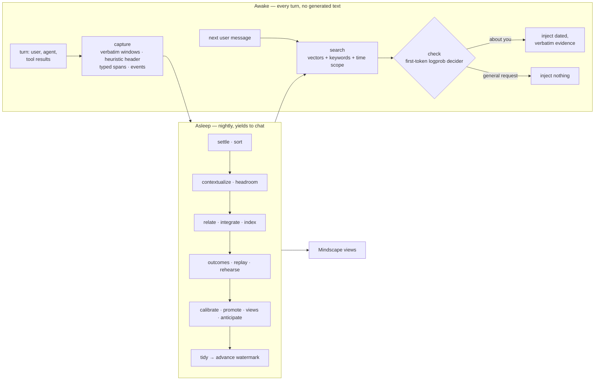

# How Sophia works

The [README](../README.md) is the short version. This page shows what Sophia does in detail, with real examples:

- [Memory injected before every reply](#memory-injected-before-every-reply): what the agent sees, and how the check decides;
- [Memory the agent can query](#memory-the-agent-can-query): the tools;
- [Mindscape](#mindscape-memory-the-agent-can-look-around-in): the pages the night builds;
- [Task memory](#task-memory-what-the-agent-did-and-how-it-turned-out): what the agent did, and how it turned out;
- [Across sessions](#what-it-looks-like-across-sessions): a plan that changes, end to end;
- [The machinery](#the-machinery): capture by day, the nightly run;
- [How it compares](#how-it-compares), [principles](#principles), [models and servers](#models-and-servers), [commands](#commands).

For the dashboard tab where you watch, correct and configure memory, see [DASHBOARD.md](DASHBOARD.md). For every setting, see [CONFIGURATION.md](CONFIGURATION.md).

## Memory injected before every reply

Each time you send a message, before the agent's model sees it, Sophia:

1. **Searches** everything it has recorded: conversations, pages the agent read, and facts extracted overnight. It combines vector search, keyword search, and date scoping for "last week" style questions.
2. **Follows the graph** one hop from the people and things in the best matches that the question itself doesn't name. The question "Where does Sam's sister live?" matches `Sam | has a sister named | Lily`, and the hop through Lily reaches `Lily | moved to | Denver`, which similarity alone ranked too low to inject.
3. **Checks** what, if anything, bears on your message. A small local model reads the message, and the previous one if this is a short follow-up like "and the other one?". It also reads the top 10 matches, then picks one answer:
   - nothing is needed: a general request, where the reply would be the same for anyone;
   - it's about you, but none of these fits;
   - this memory bears on it most directly.

   It answers by reading the probability of its first token, without generating any text, in about half a second.
4. **Injects** nothing for a general request. Otherwise it injects the matches as dated quotes. When none of them fits, the block is headed *possible matches only*, so the agent doesn't take a near-miss for an answer.

This is a real injection from the test profile, for "Which camera am I taking on the Yosemite trip?". The gate read it as about Joey, with the memories bearing on it (`choice:g0.00,n0.00,m1.00`, 448 ms). It is an excerpt: 3 of the 7 items, listed by date as injected.

```text
Sophia memory — verbatim evidence from earlier conversations and reading (dates are when it was said; treat
assistant-authored lines as weaker evidence, listed by date):
2026-09-23:
- [2026-09-23 · Joey · used +2 · later changed: Joey is bringing Fujifilm X-T5 → Sony A7 IV to Yosemite
  (2026-09-23) · fact: Sam is coming on the trip to Yosemite (planned, happens 2027-05-08/2027-05-15); Joey is
  staying at Curry Village (planned, happens 2027-05-08/2027-05-15) · "second week of May" = 2027-05-08/2027-05-15]
  Hi, some context for later. I'm Joey. For the Yosemite trip in the second week of May I'm bringing my Fujifilm
  X-T5, Sam is coming along, and we're staying at Curry Village again.
- [2026-09-23 · Joey · fact: Joey is not bringing Fujifilm camera to Yosemite (planned); Joey is bringing Sony A7 IV
  to Yosemite (planned)] Change of plans for Yosemite: I'm bringing the Sony A7 IV instead of the Fujifilm, the
  Fujifilm's sensor is acting up. Just acknowledge.
2026-09-24:
- [2026-09-24 · Joey · used +1 · linked via Sam · fact: Sam has a sister named Lily (asserted)] By the way, Sam's
  sister is named Lily. Just acknowledge briefly.
```

What the agent is told about each item:

| Label | Meaning |
|---|---|
| The quoted words | Always the original text. Extracted facts (`subject \| relation \| object`) help find it and label it; they never replace it |
| `planned`, `habitual`, `negated`, … | How the fact was said |
| `happens` | When it takes place, as distinct from when it was said |
| `"next weekend" = 2024-06-29/2024-07-01` | A relative time word resolved to the date it meant when it was said. If it pointed ahead and that date is over, it adds `now past; this line doesn't say if it happened`, so an old plan isn't read as still coming up, or as done |
| `evidence later changed` | These words include something that was later superseded, so the agent doesn't repeat a stale plan |
| `assistant said` | The agent's own earlier words: weaker evidence, and capped at two per injection |
| `linked via Lily` | Reached through the graph rather than by similarity |
| `untrusted source text` | Text from a web page, which the agent must treat as data, not instructions |
| `used +0.25` | Credit earned when this item actually helped a past answer. It affects ordering only, never whether an item may be shown |
| `possible matches only` (block heading) | The check found nothing that fits the message, so everything below is at best a lead |

For an off-topic message ("What's the capital of Australia?") the check answered "nothing is needed" with probability 1.00 (`choice:g1.00,n0.00,m0.00`), so nothing was injected.

**What is never injected:**
- the agent repeating memory back (echoes);
- agent replies that stated facts about you that nothing in the turn supported. These are checked as they're captured, because an invented answer recalled later becomes "memory";
- your own earlier questions, which carry no facts;
- failed page fetches.

## Memory the agent can query

| Tool | Answers |
|---|---|
| `sophia_recall` | "Dig deeper": a wider search. `history: true` also returns superseded facts and when they held |
| `sophia_query` | "How many… / list every… / what happened between…". Filters facts and sums typed values such as money |
| `sophia_browse` | "What do you know about…": reads Mindscape (below) |
| `sophia_remember` | "Keep this", or marks a recalled item `helpful` or `wrong`. This is the strongest learning signal memory gets |
| `sophia_correct` | "That line wasn't Joey's" or "that fact is wrong": relabels who said a message, or retracts a fact. A reason is required; it's journaled and can be undone |
| `sophia_ingest` | "Learn this document" |

Pages the agent reads with `web_extract` or the browser are learned automatically, so `sophia_ingest` is only for documents obtained some other way. A real `sophia_query` call, `{"subject": "Joey"}`, trimmed:

```json
{"count": 4, "items": [
  {"fact": ["Joey", "is bringing", "Sony A7 IV to Yosemite"], "modality": "planned", "status": "active", "believed_from": "2026-09-23 14:38"},
  {"fact": ["Joey", "is staying at", "Curry Village"], "modality": "planned", "happens": "2027-05-08/2027-05-15", "status": "active"},
  …]}
```

## Mindscape: memory the agent can look around in

Recall answers a question. **Mindscape is for when you don't know the question yet.**

Every night Sophia reorganizes what it knows into views:

| View | What it shows |
|---|---|
| `entity` | Everything currently believed about a person, place or thing, the history of what changed, and every mention with its date and speaker. A full page appears once enough is known |
| `timeline` | What was said, or what happens, in a date range such as "last week" or "March" |
| `recent` | Today's memory, before the night has consolidated it |
| `sources` | The pages and documents it learned from |
| `changes` | What last night learned, superseded or merged. Supersessions can be undone |
| `topics` | The relations and entities that emerged, and which of them have been promoted to canonical structure |

Nobody designs these pages; they emerge from what you talk about. Relations that recur across sessions get promoted into canonical structure. The only things designed in are how to read values: dates, money, quantities, and whether something was planned or negated. Demoting structure that goes unused is part of the design but isn't built yet.

Mindscape gives you:
- **Orientation:** "what do you know about Dr. Patel?" returns a page, not a pile of search hits.
- **Provenance:** every belief traces back to who said it and when.
- **Accountability:** you can see what changed overnight, and undo a supersession.

Real output of `sophia_browse {"view": "entity", "key": "Dr. Patel"}`, trimmed:

```json
{"entity": "Dr. Patel",
 "current": [["Dr. Patel", "moved his office to", "55 Oak Avenue in Palo Alto", "asserted"]],
 "history": [],
 "mentions": [{"date": "2026-09-23 14:36", "speaker": "Joey",
               "text": "Also, my dentist Dr. Patel moved his office to 55 Oak Avenue in Palo Alto. …"}, …]}
```

The agent reaches Mindscape through `sophia_browse`. You read the same pages in the Sophia tab of the Hermes dashboard: see [DASHBOARD.md](DASHBOARD.md#mindscape).

## Task memory: what the agent did, and how it turned out

Hermes's own skills are the *rulebook*: general "how we do X" rules, which Hermes writes itself as it works. Sophia keeps the *logbook*: what actually happened each time.

- **By day, with no model calls.** Every tool call is recorded in order, with:
  - its arguments (secrets redacted) and the start and end of its result;
  - its exit code or error;
  - the request it served.

  Credential and vault tools are never recorded.
- **At night.** The action log is split into tasks. A follow-up like "try python3.12 instead" joins the task it continues. The outcome is judged from the results and your reaction: succeeded, failed, partly, abandoned or unclear. Then a card is written. The night model only points at logged actions by number, and code assembles the card from the log, so **a card can't contain a step the agent didn't take**.
- **In recall.** When a request resembles a past task, its card is injected. A failed or abandoned attempt comes with a warning. `sophia_browse {"view": "tasks"}` lists past tasks, and passing a task id returns its full action log.
- **Credit.** When a card is followed again, it gains credit if the task succeeds and loses credit if it fails.

This card came from a real run on the test profile. The agent was asked to create `/tmp/sophia-task-demo`, write a file and report its checksum:

```text
- [2026-09-24 · earlier task · succeeded] Create directory, write text file, and compute sha256sum
  (/tmp/sophia-task-demo) — succeeded on 2026-09-24. Worked: `mkdir -p /tmp/sophia-task-demo` →
  `write_file(path="/tmp/sophia-task-demo/notes.txt", content="hello from sophia")` →
  `sha256sum /tmp/sophia-task-demo/notes.txt`.
```

In a fresh session, "Do the sophia-task-demo notes file thing again, the same way as last time" injected only this card (0.88), and the agent redid the task.

On five scripted sessions with known outcomes (`bench/tasks_eval.py`, 9B night), the results were:
- **Outcomes:** 5/5.
- **Task splits:** 5/5.
- **Card details:** 5/5 (dead ends with reasons, doc links, the corrected step).
- **Recall:** 4/4. The right card came back for every "do it again" request.

For example:

```text
Rotate nginx logs on web-1 to free disk space (web-1) — succeeded. Worked: `ssh web-1 'sudo logrotate -f
/etc/logrotate.d/nginx'`. Dead ends: `ssh web-1 'rm /var/log/nginx/access.log'` (permission denied without
sudo). Lesson: Use sudo with logrotate instead of manually deleting log files
```

## What it looks like across sessions

These are verbatim excerpts from real sessions on the test profile. Each one is a fresh `hermes chat`, and Hermes's built-in memory is switched off, so Sophia is the only link between them.

```text
session 1  Joey:   Hi, some context for later. I'm Joey. For the Yosemite trip in the second week
                   of May I'm bringing my Fujifilm X-T5, Sam is coming along, and we're staying at
                   Curry Village again. Also, my dentist Dr. Patel moved his office to 55 Oak
                   Avenue in Palo Alto. Just acknowledge briefly.

session 2  Joey:   Quick question: what camera am I bringing to Yosemite, who's coming, and where
                   is my dentist's office now?
           [gate: decider 0.97 → inject]
           Hermes: - Yosemite camera: Fujifilm X-T5  - Who's coming: Sam
                   - Dentist (Dr. Patel): 55 Oak Avenue, Palo Alto

session 3  Joey:   Change of plans for Yosemite: I'm bringing the Sony A7 IV instead of the
                   Fujifilm, the Fujifilm's sensor is acting up. Just acknowledge.

$ hermes -p sophiadev sophia sleep --model qwen35-9b                      # ~44 s
$ hermes -p sophiadev sophia journal
  #61 (undoable)  integrate  superseded  {"old": ["Joey", "is bringing", "Fujifilm X-T5"],
                                          "new": ["Joey", "is bringing", "Sony A7 IV to Yosemite"]}

session 4  Joey:   Which camera am I taking on the Yosemite trip?
           [gate: decider 0.95 → inject]
           Hermes: You're bringing the Sony A7 IV to your Yosemite trip 📷
                   Originally you had planned to bring your Fujifilm X-T5, but the camera's sensor
                   has been acting up, so you've switched to the Sony A7 IV instead.
```

Extraction is imperfect; notice the object "Sony A7 IV to Yosemite". That is exactly why the agent always sees the original words and not just the extracted facts.

## The machinery



### Awake: capture

Nothing generates text on the chat's critical path.

- **Turns.** Each turn is split into small verbatim windows. Each window gets a cheap header (speaker, date, the question it answers, names in play) and deterministic typed values: times, durations, quantities, money, contacts, artifacts.
- **Actions.** Every tool call is recorded with its arguments, the start and end of its result, its exit code, and the request it served. This is the raw material for task memory.
- **Web reads.** Pages the agent reads are captured as sources. Failed fetches are dropped, and credential or vault tools are never captured.
- **Speed.** Capture takes about 0.1 s per turn, off the critical path. The search-check-inject step takes 260–460 ms on the test profile.

### Asleep: the nightly run

`hermes sophia sleep` runs 16 steps in six phases:

| Phase | What happens |
|---|---|
| **Settle, sort** | Snapshot the day. Drop error pages, boilerplate, and pages that try to instruct the agent |
| **Understand** | A model writes context headers for every window, such as what "yes" agreed to or who "she" is. The headers are re-embedded; the evidence stays verbatim |
| **Consolidate** | Split the action log into tasks, judge each outcome, and write task cards. Extract facts with modality and when they happen, and resolve entities. When a newer fact on the same relation names a different object, retire the older one: automatically for relations learned to be exclusive, otherwise judged against the new evidence. Plans whose date passed become "unconfirmed". Facts from other speakers' lines (another agent relaying through the CLI, say) are kept only if that line names who they're about |
| **Dream** | Replay the day's injections and judge which ones helped. Rehearse new facts with self-made questions, and repair whatever recall misses. Collect labels to calibrate the check |
| **Organize** | Promote recurring relations and build the Mindscape views |
| **Tidy** | Decay only what was repeatedly judged irrelevant, never facts flagged important (health, money, key dates). Journal everything with undo. Advance the watermark last, so an interrupted night simply reruns |

The night waits while the big model is serving chat, and yields rather than competing with you. It records its progress as it goes, and the Sophia tab shows it live.

## How it compares

The data model (three clocks, supersession, provenance, triples indexing passages) has converged with the best graph memories: Graphiti/Zep, SodaMem, HippoRAG 2 and Hindsight. What's different is how Sophia behaves:
- it makes no model calls when something is saved;
- it checks relevance, can inject nothing, and says so when nothing it found fits;
- its own invented claims can't become memory;
- a night tests and repairs its own recall.

**Benchmarks** (held-out data, local models as reader and judge; [BENCHMARKS.md](BENCHMARKS.md)). *Passive* means injection only; *active* means the agent also uses Sophia's tools:
- **LoCoMo, 7 conversations:** active recall with a 27B reader scores J 0.869, on par with the same reader given the whole conversation (0.853). Passive: 0.806 with the 27B reader, 0.789 with the 9B.
- **LongMemEval-S:** 0.802 on all 500 questions (9B reader, passive). On the 60 held-out questions, passive scores 0.867 with the 27B reader, against 0.900 when it's handed just the evidence sessions.
- **Response time:** passive recall adds about 0.6 s per message on a 2,000-window memory with llama-server, almost all of it one relevance check. That check keeps memory out of 34 of 40 held-out general requests and 9 of 10 follow-ups to them. `gate: similarity` cuts the time to under 0.1 s, at the cost of letting memory through on nearly every message.
- **[Almanac](https://github.com/jbpayton/almanac)** (a benchmark of time, plans, provenance, absence, tasks and memory hygiene, written alongside Sophia): passive, by day, 1.000, against 0.945 for full context and 0.899 for RAG. It also found a secret-redaction bug, now fixed.

These aren't directly comparable with published GPT-4o-judged numbers. The comparison and sources are in [COMPARISON.md](COMPARISON.md).

## Principles

- **The raw record is the truth; everything else is an index.**
- **Similarity ranks; the decider judges.** Cosine scores can't tell "related" from "answers it": unanswerable near-misses scored up to 0.78.
- **Emergent over prescribed.** Design how to read values, not what the world contains.
- **Credit orders what is shown; it never decides what may be shown.**
- **Degrade loudly.** If a model is missing, Sophia carries on without it, and `sophia status` and the Sophia tab say so.

The full reasoning is in [DESIGN.md](DESIGN.md).

## Models and servers

Sophia runs on any local model server that speaks the OpenAI API: llama-server, vLLM, LM Studio and others. Each job has its own model, and can have its own server:

```yaml
memory:
  provider: sophia
  sophia:
    server_url: http://127.0.0.1:8080       # the server every job uses
    server_type: openai                     # openai (llama-server, vLLM, …) | lmstudio (LM Studio's own API)
    embed_model: nomic-embed
    decider_model: qwen35-9b
    sleep_model: qwen/qwen3.8-27b
    decider_url: http://127.0.0.1:8081      # optional: this job only, e.g. a llama-server on its own GPU
```

If other people or agents write into your conversations (another agent relaying through the CLI, say), list them in `other_speakers`. A message that opens with `Name:` or `**Name:**` is then attributed to them, not to you.

`hermes sophia status` shows where each job actually runs. Every setting is described in [CONFIGURATION.md](CONFIGURATION.md). The data lives in `$HERMES_HOME/plugin-data/sophia/sophia.db` (SQLite). It uses WAL only where the linked SQLite is free of the [WAL-reset bug](https://sqlite.org/wal.html#walresetbug) (3.51.3 and later, or the 3.50.7 and 3.44.6 backports), the same rule Hermes applies to its own databases; otherwise it uses a rollback journal. An existing WAL store is left in WAL, because switching it while the gateway or a night holds it would lose their commits. To switch one, stop the gateway first.

## Commands

```bash
hermes -p <profile> sophia status                  # sizes, where each job runs, last night, degraded modes
hermes -p <profile> sophia recall "what camera…" --gate
hermes -p <profile> sophia sleep [--model M] [--url U --api openai] [--steps a,b] [--max-wait S]
hermes -p <profile> sophia journal                 # what last night learned; #ids marked undoable
hermes -p <profile> sophia undo <id>
hermes -p <profile> sophia relabel --session S --from Joey --to Claude --reason "…"   # who said a session's lines
hermes -p <profile> sophia audit-facts [--apply]   # facts from relayed lines that don't name who they're about
hermes -p <profile> sophia drop-compaction         # keep old context-compaction summaries out of recall
hermes -p <profile> sophia reconsolidate           # drop derived facts; the next night rebuilds them from raw
hermes -p <profile> sophia ingest-history --days 7 # import past sessions (idempotent)
hermes dashboard                                    # the Sophia tab (see DASHBOARD.md)
```

Every correction is journaled with its reason, and `undo` reverts it.

Nothing is scheduled for you. When you're ready, add a nightly run:

```cron
30 3 * * * hermes -p <profile> sophia sleep >> ~/.hermes/profiles/<profile>/logs/sophia-sleep.log 2>&1
```

The Sophia tab reads this line to show when the next night is due.

## Install notes

- **Check model size.** Don't go much smaller than the recommended 9B for the check before each reply: a 0.8B model waved "What's the capital of Australia?" through at 0.90, which would inject noise into every turn. The check only reads token probabilities, so reasoning should be off.
- **Only memory.** Sophia works beside Hermes's built-in memory. To make it the only one, set `memory.memory_enabled false` and `memory.user_profile_enabled false`.
- **Other settings.** Any setting can be set directly, for example `hermes config set memory.sophia.decider_model qwen35-9b`. Setup's two extra questions reveal per-job servers and the advanced tuning.
- **Installing with pip.** The package also declares a `hermes_agent.memory_providers` entry point for `pip install`; that path hasn't been tested in Hermes yet. `numpy` is its only dependency, and it's already in the Hermes venv.
